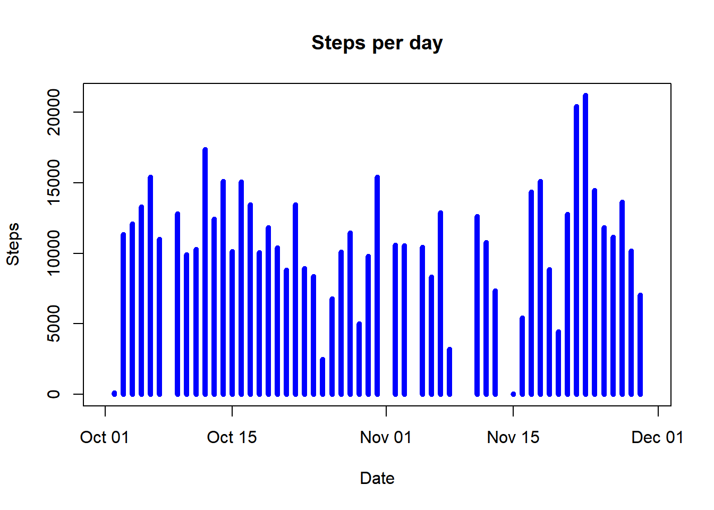
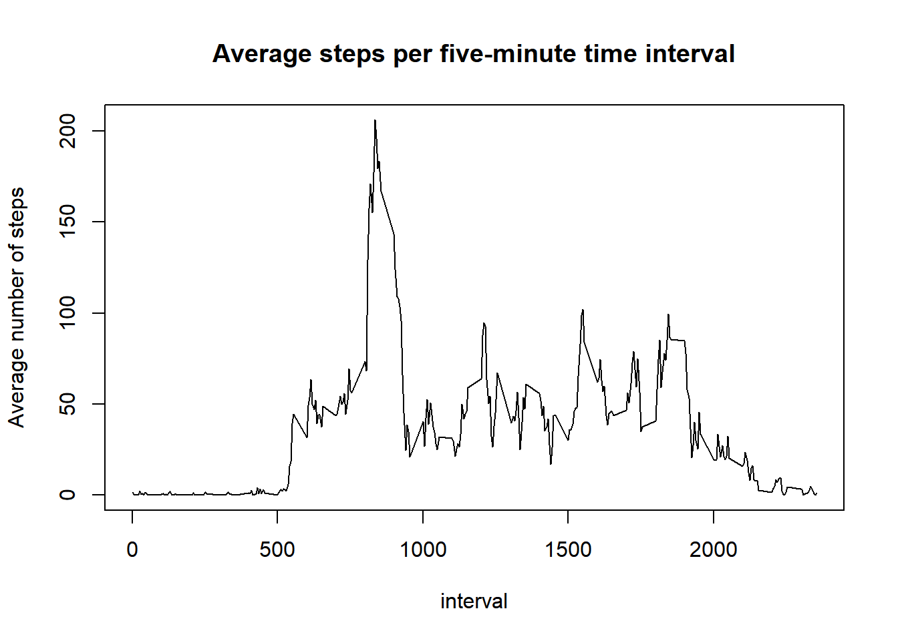
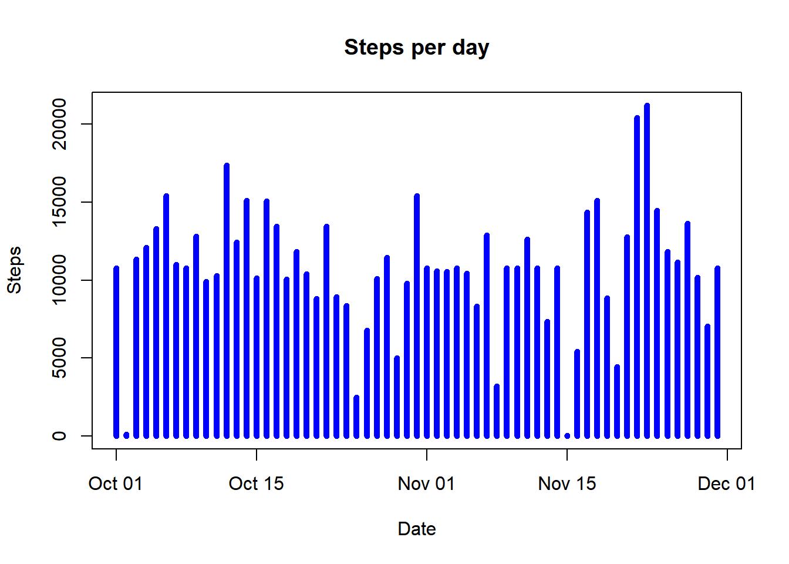
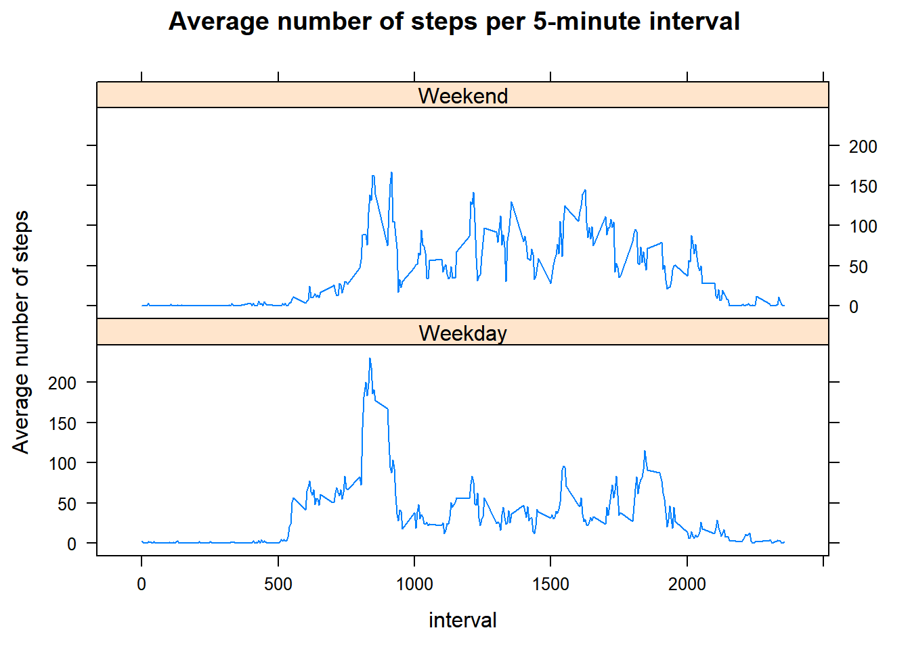

# Reproducible Research: Peer Assessment 1


## Loading and preprocessing the data

1. We load the data and the necessary libraries:


```r
library(dplyr)
```

```
## Warning: package 'dplyr' was built under R version 3.3.3
```

```
## 
## Attaching package: 'dplyr'
```

```
## The following objects are masked from 'package:stats':
## 
##     filter, lag
```

```
## The following objects are masked from 'package:base':
## 
##     intersect, setdiff, setequal, union
```

```r
library(lattice)
myDat <- read.csv("activity.csv")
```

2. We now convert the date field to a date type:

```r
myDat$date <- as.Date(myDat$date)
```

## What is mean total number of steps taken per day?

1. We compute the steps per day and store in a data frame

```r
dailySteps <- sapply(split(myDat$steps,myDat$date),sum)
dailyDat <- data.frame(date=as.Date(names(dailySteps)),steps=dailySteps)
```

2. We now plot the number of steps per day

```r
plot(dailyDat$date, dailyDat$steps, type="h", lwd=5,col="blue",
     main="Steps per day",ylab="Steps",xlab="Date")
```

<!-- -->

3. We compute the mean and median number of steps per day

```r
mean(dailyDat$steps, na.rm=TRUE)
```

```
## [1] 10766.19
```

```r
median(dailyDat$steps, na.rm=TRUE)
```

```
## [1] 10765
```
## What is the average daily activity pattern?
1. We calculate the average number of steps per time interval, store in a data frame and plot.

```r
intAvg <- sapply(split(myDat$steps,myDat$interval),
                 function(x){mean(x,na.rm=TRUE)})
intDat <- data.frame(interval=as.numeric(names(intAvg)), avgSteps=intAvg)
with(intDat,plot(interval, avgSteps, type="l", 
     main="Average steps per five-minute time interval",
     ylab="Average number of steps"))
```

<!-- -->

2. We compute the 5-minute interval that contains the maximum number of average steps

```r
as.numeric(names(which.max(intAvg)))
```

```
## [1] 835
```
##Imputing missing values
1. We calculate the total number of missing values.

```r
sum(is.na(myDat$steps))
```

```
## [1] 2304
```

2. Our strategy for filling in the missing values is to use the mean of the corresponding 5-minute interval.

3. We implement the above strategy to create a new data frame

```r
intToInd <- function(x) {floor(x/100)*12+(x%%100)/5+1}
myDatImp <- mutate(myDat, steps=ifelse(is.na(steps), 
                          intAvg[intToInd(interval)], steps))
```

4. We now repeat the steps of the first section to plot the number of steps per day and calculate the mean and median number of steps per day.

```r
dailyStepsImp <- sapply(split(myDatImp$steps,myDatImp$date),sum)
dailyDatImp <- data.frame(date=as.Date(names(dailyStepsImp)),
                          steps=dailyStepsImp)
plot(dailyDatImp$date, dailyDatImp$steps, type="h", lwd=5,col="blue",
     main="Steps per day",ylab="Steps",xlab="Date")
```

<!-- -->

```r
mean(dailyDatImp$steps, na.rm=TRUE)
```

```
## [1] 10766.19
```

```r
median(dailyDatImp$steps, na.rm=TRUE)
```

```
## [1] 10766.19
```

Note that the histogram has changed (there are more steps on days with previously missing values), the mean stayed the same, and the median has changed to match the mean.

## Are there differences in activity patterns between weekdays and weekends?

1. We create a new factor variable indicating whether a given date is a weekday or weekend.

```r
myDatImp <- mutate(myDatImp, dayType= factor(ifelse(
                     sapply(weekdays(date),
                      function(t) {any (t == c("Saturday", "Sunday"))}),
                     "Weekend","Weekday")))
```
2. We calculate the average number of steps per 5-minute interval separately for weekdays and weekends, and plot.

```r
s<- with(myDatImp,sapply(split(steps, list(interval, dayType)), mean))
x<-strsplit(names(s),".", fixed=TRUE)
f<- data.frame(avgSteps = s, 
               interval = as.numeric(sapply(x, function(a){a[1]})), 
               dayType = sapply(x, function(a){a[2]}))
xyplot(avgSteps ~ interval | dayType, f, type="l", layout=c(1,2), 
          main="Average number of steps per 5-minute interval",
          ylab="Average number of steps")
```

<!-- -->
